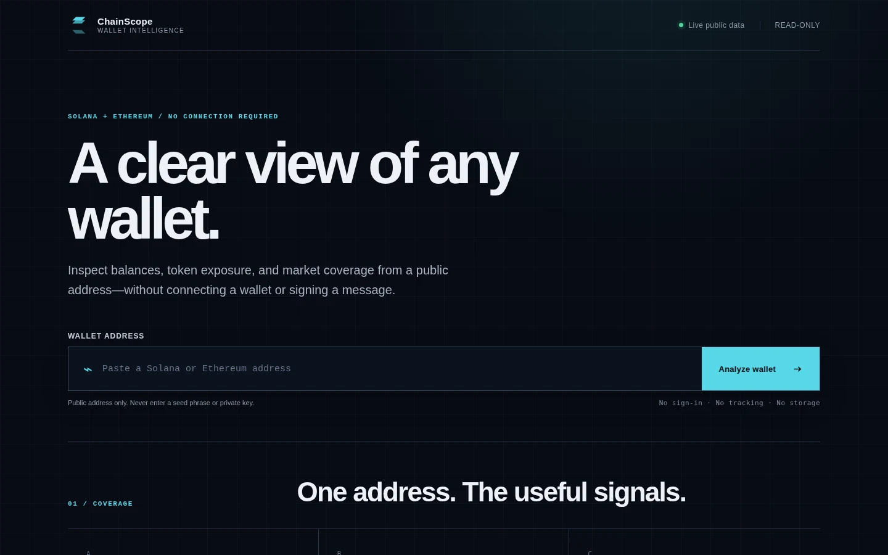

# 🚀 ChainScope — Solana & Ethereum Wallet Analyzer

A read-only web application and async Telegram bot for inspecting public Solana and Ethereum addresses. It reports native balances and USD values, with detailed SPL-token portfolio analytics for Solana wallets—without connecting a wallet or requesting a signature.

## 🖥️ Product Preview



## ✨ Features

### 🎯 **Core Features**

- **Responsive Web UI**: Paste an address and inspect a structured portfolio snapshot in any modern browser
- **Two-chain Support**: Analyze Solana and Ethereum addresses
- **Real-time Data**: Native-asset prices from Coinbase with CoinGecko fallback, plus Solana token market data from DexScreener
- **Solana Portfolio Analytics**: legacy SPL Token and Token-2022 holdings, market metrics, allocation, and dust filtering
- **Asset Composition**: Compare the native asset and leading valued token positions with accessible proportional bars; single-asset wallets avoid a redundant chart
- **Holdings Workspace**: Search and sort token holdings, hide valued dust, and retain unpriced assets for honest coverage
- **Token Identity**: Display available Solana token logos with deterministic symbol fallbacks
- **Portable Snapshots**: Copy the analyzed address or export the current result as CSV or JSON entirely in the browser
- **Privacy-aware Sharing**: Copy a fragment-only address link that pre-fills the form without triggering automatic analysis
- **Resilient Refresh**: Request a fresh provider snapshot, preserve the previous result on failure, and retry provider errors in place
- **Two Interfaces**: Browser portfolio view plus Telegram pagination, progress indicators, and explorer links
- **Read-only by Design**: No wallet connection, signing request, transaction capability, or browser storage
- **Truthful Failure States**: provider failures are reported as unavailable instead of being shown as zero balances

### 👑 **Admin Features**

- **User Tracking**: Auto-log new users with sequential numbering
- **Flexible Logging**: Private channel/group or direct messages
- **Statistics**: `/stats` command for user metrics and analytics
- **Milestone Alerts**: Notifications every 10 new users

## 🛠️ Quick Setup

### 1. **Prerequisites**

- Python 3.11 or newer (`python --version`)
- Node.js 22 or newer for building or developing the web interface
- A Telegram bot token from [@BotFather](https://t.me/BotFather)
Coinbase, CoinGecko, DexScreener, and the default public Ethereum JSON-RPC endpoint do not require API keys for the requests made by this application.

### 2. **Installation**

On Linux or macOS:

```bash
git clone https://github.com/dk3yyyy/sol-eth-wallet-analyzer.git
cd sol-eth-wallet-analyzer
python -m venv .venv
source .venv/bin/activate
python -m pip install --upgrade pip
python -m pip install -r requirements.txt
```

On Windows PowerShell:

```powershell
git clone https://github.com/dk3yyyy/sol-eth-wallet-analyzer.git
Set-Location sol-eth-wallet-analyzer
python -m venv .venv
.\.venv\Scripts\Activate.ps1
python -m pip install --upgrade pip
python -m pip install -r requirements.txt
```

### 3. **Configuration**

Copy the provided environment template:

```bash
cp .env.example .env
```

On Windows PowerShell, use `Copy-Item .env.example .env` instead. Open `.env` and replace the values needed by the interface you plan to run. `TELEGRAM_TOKEN` is required only for the Telegram bot; the RPC settings are optional overrides:

```env
TELEGRAM_TOKEN=your_bot_token_here

# Optional custom Ethereum JSON-RPC endpoint
ETHEREUM_RPC_URL=https://ethereum-rpc.publicnode.com

# Optional custom Solana JSON-RPC endpoint
SOLANA_RPC_URL=https://api.mainnet-beta.solana.com

# Admin Features (Optional)
ADMIN_CHAT_ID=your_chat_id                    # For stats access
LOG_CHANNEL_ID=-1001234567890                 # For user logging (recommended)
```

### 4. **Run the web application**

Build the browser assets and start the same-origin FastAPI server:

```bash
npm ci
npm run build
uvicorn web_app:app --host 127.0.0.1 --port 8000
```

Open `http://127.0.0.1:8000`. For frontend development with hot reload, run `npm run dev` in a second terminal; Vite proxies `/api` to FastAPI on port 8000.

The production container builds the frontend and runs the API as a non-root user:

```bash
docker build -t wallet-analyzer .
docker run --rm -p 8000:8000 --env-file .env wallet-analyzer
```

### 5. **Run the Telegram bot**

```bash
python main.py
```

The bot uses long polling and keeps running until you stop it with `Ctrl+C`. Environment variables are loaded at startup, so restart the process after changing `.env`.

## 📊 Admin Setup

### **Option 1: Channel Logging (Recommended)**

1. Create private Telegram channel
2. Add bot as admin with "Post Messages" permission
3. Forward message from channel to [@userinfobot](https://t.me/userinfobot) to get ID
4. Add `LOG_CHANNEL_ID=-1001234567890` to `.env`

### **Option 2: Direct Messages**

1. Message [@userinfobot](https://t.me/userinfobot) to get your chat ID
2. Add `ADMIN_CHAT_ID=123456789` to `.env`

## 🎮 Usage

### **Commands**

- `/start` — Welcome & features overview
- `/status` — Bot health check  
- `/stats` — Admin user statistics

### **Wallet Analysis**

Send any wallet address:

- **Solana**: `11111112D4FgiiiikjQKNNh4rJN4rENWDCK8`
- **Ethereum**: `0x742d35Cc6634C0532925a3b8D4037C973B26Ed33`

The bot auto-detects the address type and provides:

- Native SOL or ETH balance and estimated USD value
- SPL-token holdings and market data for Solana addresses
- Solana portfolio allocation percentages
- Interactive navigation for large Solana portfolios

## 🔧 Configuration

| Variable | Description | Required |
|----------|-------------|----------|
| `TELEGRAM_TOKEN` | Bot token from BotFather | ✅ Telegram only |
| `ETHEREUM_RPC_URL` | Ethereum JSON-RPC endpoint; defaults to PublicNode | ⚪ Optional |
| `SOLANA_RPC_URL` | Solana JSON-RPC endpoint | ⚪ Optional |
| `ANALYZE_RATE_LIMIT` | Web analyses permitted per client/window; defaults to 20 | ⚪ Optional |
| `ANALYZE_RATE_WINDOW_SECONDS` | Web rate-limit window; defaults to 60 seconds | ⚪ Optional |
| `ADMIN_CHAT_ID` | Your chat ID for admin access | ⚪ Optional |
| `LOG_CHANNEL_ID` | Channel/group ID for user logs | ⚪ Optional |

### **Bot Settings**

- **Cache**: 5 minutes for faster responses
- **Dust Filter**: $0.01 minimum token value  
- **Pagination**: 6 tokens per page
- **Batch limit**: 10 submitted addresses per message
- **Token concurrency**: At most 8 simultaneous DexScreener lookups per analysis
- **APIs**: Solana JSON-RPC, Ethereum JSON-RPC, Coinbase, CoinGecko, and DexScreener

## 🔒 Security & Performance

- ✅ Environment variables for secrets
- ✅ Smart caching system
- ✅ Bounded request concurrency, timeouts, retries, and bounded caches
- ✅ Explicit provider-error and partial-token-metadata reporting
- ✅ Atomic, synchronized user-data persistence
- ✅ Async processing for speed

### Data and privacy

The web application does not use cookies, analytics, local storage, session storage, accounts, or a wallet-connection library. It does not persist submitted addresses. CSV and JSON exports are generated locally in the browser. Share links place the address after `#`, which prevents it from being included in the HTTP request; the address remains visible in the URL and browser history, and opening the link only pre-fills the form until the user submits it. Its in-memory rate limiter stores only bounded client identifiers and request timestamps for the configured window. Submitted public addresses are still sent to the configured Solana RPC, the configured Ethereum JSON-RPC provider (PublicNode by default), CoinGecko, or DexScreener as required for analysis. Token logos are fetched by the server from DexScreener's allowlisted image CDN and served through a same-origin endpoint, so the browser does not contact the image provider; only validated raster formats up to 512 KiB are accepted, and missing or failed images fall back to a symbol monogram. Logo payloads use a separate byte-budgeted cache capped at 8 MiB and 256 entries per worker, with at most eight active upstream fetches and 32 admitted jobs, same-mint request coalescing, and short-lived negative caching. Excess distinct jobs fail closed to the monogram fallback. Operators should configure trusted proxy handling deliberately before relying on forwarded client IPs.

The Telegram bot stores Telegram user IDs, names, usernames, language codes, join/last-active timestamps, and interaction counters in `user_data.json`. The file is written atomically with owner-only permissions on supported systems, but it is still plaintext. Operators are responsible for access control, backups, retention, deletion requests, and an appropriate privacy notice.

### Failure behavior

- Ethereum RPC errors, malformed responses, and timeouts stop that wallet report; they never produce a synthetic `0 ETH` result.
- Solana RPC errors, malformed responses, timeouts, and incomplete legacy/Token-2022 account queries stop that wallet report with a retryable warning.
- Native-price requests use Coinbase first and CoinGecko as a fallback; reports stop only when both providers fail.
- Individual DexScreener metadata failures are omitted from token valuation and disclosed as partial data.
- HTTP 429 and server errors use bounded retries. Failed results are not cached as valid zero values.
- Refresh actions bypass the relevant five-minute caches.

## 🧪 Development and verification

```bash
python -m venv .venv
.venv/bin/python -m pip install -r requirements-dev.txt
npm ci
npm run build
.venv/bin/python -m pytest -q
npm run test:browser
PYTHON=.venv/bin/python npm run test:production
.venv/bin/python -m ruff check .
.venv/bin/python -m bandit -q -r main.py services.py utils.py analyzer.py web_app.py --severity-level medium --confidence-level medium
.venv/bin/python -m pip_audit -r requirements.txt -r requirements-dev.txt
npm audit --audit-level=high
```

GitHub Actions runs tests on Python 3.11 and 3.13, builds the React application, runs Chromium browser tests, builds the production container, and applies Python/Node lint, security, dependency-audit, and compilation gates. Tests mock external providers and do not send Telegram messages or require real API credentials.

### Disable and roll back

Stop Uvicorn or the container to disable the web interface. Stop the bot process to disable Telegram polling; no external scheduler is installed by this repository. Back up `user_data.json` before bot migrations. To roll back a release, restore the previous code revision and its matching Python/Node dependency sets, rebuild, and restart. Do not replace `user_data.json` while the bot is running.

## 🐛 Troubleshooting

| Symptom | What to check |
|---------|---------------|
| `TELEGRAM_TOKEN is not set` | Confirm `.env` exists in the repository root, `TELEGRAM_TOKEN` is not still a placeholder, and the bot was restarted after editing the file. |
| Ethereum balance is unavailable | Check connectivity to `ETHEREUM_RPC_URL`, or configure a reliable Ethereum JSON-RPC provider and restart the process. |
| Telegram reports another `getUpdates` request | Only one process can poll with a bot token. Stop the other local or deployed instance before starting this one. |
| `/stats` reports that access is restricted | Set `ADMIN_CHAT_ID` to the numeric chat ID of the user who will run `/stats`; `LOG_CHANNEL_ID` does not grant access to this command. Restart the bot after changing `.env`. |
| Admin logs are not delivered | Set `LOG_CHANNEL_ID` to the numeric destination ID and add the bot there with permission to post messages. This setting controls logging only and does not grant `/stats` access. |
| Solana requests are rate-limited or unavailable | Retry later or set `SOLANA_RPC_URL` to a reliable custom endpoint in `.env`, then restart the bot. |
| Responses are slow for a large Solana wallet | Large portfolios require multiple bounded market-data calls. Repeated requests use the five-minute caches. |
| A provider is unavailable | Retry after the upstream service recovers. The bot intentionally does not replace missing financial data with zero. |

## 👨‍💻 Developer

**Built by:** [dk3yyyy](https://github.com/dk3yyyy)

**Tech Stack:** Python, FastAPI, React, Vite, python-telegram-bot, aiohttp, asyncio

## 📄 License

MIT License - Free to use and modify

## ⭐ Support

If you find this useful:

- ⭐ Star the repository
- 🍴 Fork and contribute

---

*Solana and Ethereum balance analysis with detailed SPL-token portfolio insights.*
